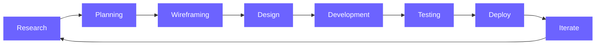

 

 

## 👩‍💻 About Me

I'm a **Software Engineer** and **UI/UX Designer** who blends visual craft with solid engineering. I design interfaces in Figma, then build them end to end, from responsive front ends to APIs and databases, so the finished product feels as good as it looks.

> *"Great software is invisible. It should feel intuitive, perform seamlessly, and solve problems elegantly."*

 

## 🛠️ Tech Stack

| | |
|:--|:--|
| **Frontend** |  |
| **Backend** |  |
| **Databases** |  |
| **Design** |  |
| **Tools** |  |

 

## 🚀 Featured Projects

<table>
<tr>
<td width="50%" valign="top">

### 🌐 Portfolio Website
A responsive portfolio showcasing my work, design approach, and technical skills.

[**Live Demo**](https://fathimarouzannifla.github.io/my-portfolio/) · [**Source Code**](https://github.com/FathimaRouzanNifla/my-portfolio)

</td>
<td width="50%" valign="top">

### ✅ Task Management Suite
A full-stack task manager with CRUD operations, user authentication, and real-time updates.

[**Live Demo**](https://github.com/FathimaRouzanNifla?tab=repositories) · [**Source Code**](https://github.com/FathimaRouzanNifla?tab=repositories)

</td>
</tr>
<tr>
<td width="50%" valign="top">

### 👥 Employee Management Platform
A modern HR solution with intuitive dashboards, employee analytics, and streamlined workflows.

[**Live Demo**](https://github.com/FathimaRouzanNifla?tab=repositories) · [**Source Code**](https://github.com/FathimaRouzanNifla?tab=repositories)

</td>
<td width="50%" valign="top">

### 🎨 Financial App Design
A mobile banking concept focused on accessibility, clear visual hierarchy, and seamless UX.

[**View on Behance**](https://www.behance.net/niflaremiez)

</td>
</tr>
</table>

 

## 🎯 Design & Development Principles

| ✨ User-Centered | ⚡ Clean Code | 🚀 Performance | ♿ Accessibility |
|:---:|:---:|:---:|:---:|
| Empathy-driven design that puts users first | Maintainable, scalable, well-architected | Optimized for speed and efficiency | Inclusive design for everyone |

 

## 🔄 Workflow

 

## 📊 GitHub Stats

 

## 🤝 Let's Connect

I'm open to collaborations, freelance projects, and new opportunities. Reach out through any of the links above, or email me at **nifla7382@gmail.com**.

